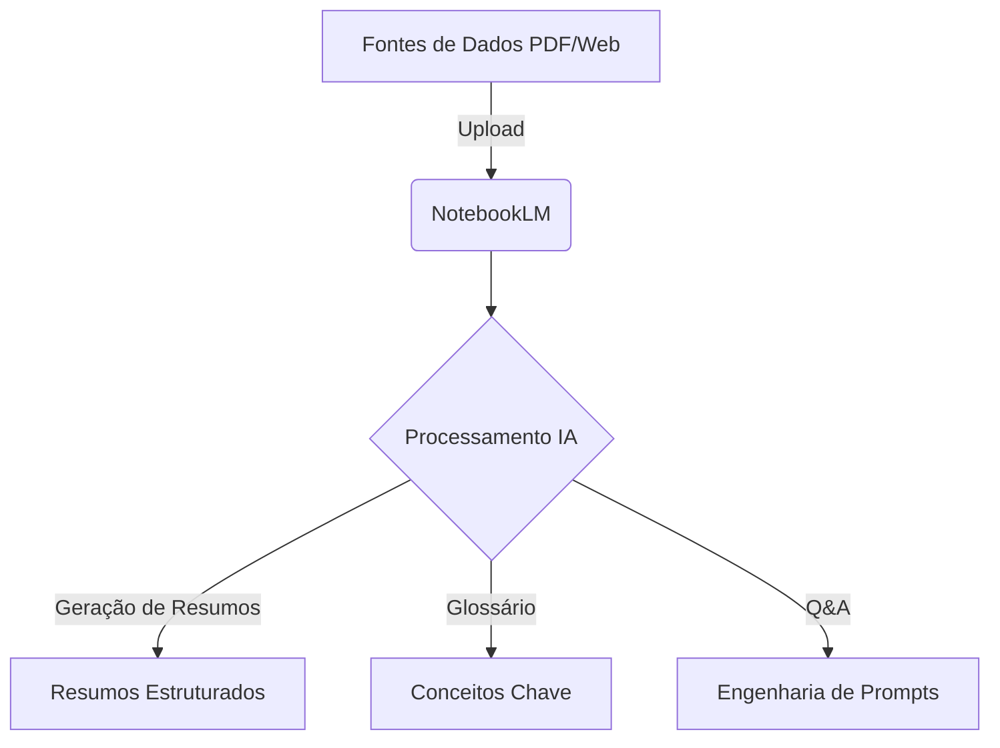

# Miniguia de Estudos: Educação Financeira com NotebookLM

## Descrição
Este projeto é um caderno temático criado com o objetivo de explorar o poder da Inteligência Artificial (especificamente o NotebookLM) para a aprendizagem ativa. Focando no tema de **Educação Financeira Introdutória**, documentamos a curadoria de fontes, testes de engenharia de prompts, e consolidamos um miniguia de estudos para acelerar a aprendizagem.

## Contexto e Objetivos
**Contexto**: A educação financeira é essencial para o bem-estar pessoal e familiar. Utilizar IA para sintetizar e aprender esses conceitos acelera a curva de aprendizado de forma notável.
**Objetivos**: 
- Compreender os fundamentos de orçamento pessoal, reserva de emergência e investimentos iniciais.
- Validar a eficácia do NotebookLM em sintetizar múltiplos PDFs e textos.
- Organizar o conhecimento gerado em um guia prático e reutilizável.

## Curadoria de Fontes
As seguintes fontes públicas foram ingeridas no nosso Caderno Temático do NotebookLM:
1. **"O Básico de Finanças Pessoais"** (Artigo / PDF) - Banco Central do Brasil.
2. **"Como Montar sua Reserva de Emergência"** (Guia Online) - Tesouro Direto.
3. **"Introdução aos Investimentos"** (E-book Educacional) - B3.

## Arquitetura do Processo de Estudo (Mermaid)


## Engenharia de Prompts e "Cicatrizes"
- **Prompt V1**: "Resuma o conteúdo sobre investimentos." 
  - *Resultado*: Muito genérico, não detalhou os tipos de investimentos.
- **Prompt V2**: "Com base nas fontes, explique a diferença entre Renda Fixa e Renda Variável para um iniciante, usando uma analogia."
  - *Resultado*: A analogia foi boa, mas faltaram exemplos práticos de ativos.
- **Prompt V3 (Sucesso)**: "Aja como um consultor financeiro. Explique os passos para montar uma reserva de emergência usando apenas as fontes fornecidas. Formate a resposta em bullet points e inclua um glossário básico."
  - *Dificuldades (Cicatrizes)*: A IA inicialmente trazia informações fora do contexto dos documentos ingeridos (alucinações sutis). Foi necessário reforçar a restrição "usando apenas as fontes fornecidas" e iterar no prompt até atingir uma resposta estrita aos textos-base.

## Miniguia de Estudo
### Resumos Estruturados
A base da educação financeira reside em três pilares: ganhar, poupar e investir. O primeiro passo é ter clareza das receitas e despesas através de um orçamento. O segundo passo é construir uma reserva de emergência equivalente a 6 meses de custo de vida, alocada em ativos de altíssima segurança e liquidez diária. O terceiro passo é começar a investir visando o longo prazo, diversificando a carteira.

### Glossário
- **Liquidez**: Facilidade e velocidade com que um ativo pode ser convertido em dinheiro em conta.
- **Renda Fixa**: Investimentos onde as regras de remuneração são conhecidas no momento da aplicação.
- **Reserva de Emergência**: Montante guardado exclusivamente para cobrir imprevistos (ex: Tesouro Selic, CDBs de liquidez diária).

### Prompts Reutilizáveis
- `Quais são as principais armadilhas financeiras citadas no documento X?`
- `Crie um quiz de 5 perguntas de múltipla escolha para testar meu conhecimento sobre o glossário, com o gabarito no final.`

## API Endpoints (Integração Teórica)
Como este projeto foca no uso de uma interface (NotebookLM), apresentamos abaixo como seria a integração teórica via API de uma aplicação LLM similar:
| Método | Rota | Parâmetros | Exemplo JSON |
|---|---|---|---|
| POST | `/api/v1/notebook/upload` | `file_path`, `type` | `{"file_path": "/docs/financas.pdf", "type": "pdf"}` |
| POST | `/api/v1/notebook/query` | `prompt`, `notebook_id` | `{"prompt": "Resuma as fontes", "notebook_id": "123"}` |

## Screenshots da Aplicação


## Instruções de Execução Local e Variáveis de Ambiente
Embora este seja um caderno temático SaaS, para rodar scripts locais automatizando chamadas para LLMs:
1. Clone este repositório.
2. Defina as variáveis de ambiente no seu arquivo `.env`:
   ```bash
   NOTEBOOK_API_KEY=sua_chave_de_api
   ```
3. Execute o script principal: `python run_query.py`

## Autor
**Wendel Vieira**
